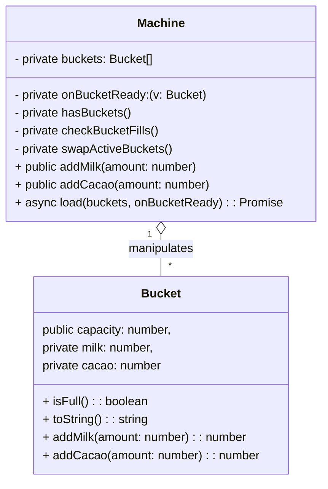

# chocolate-factory-sandbox
Sandbox code that implements defined [requirements](docs/requirements.pdf). Main source code located in `src/Machine.ts`

## Usage (docker)
```bash
docker compose up
```

## Usage (native)
```bash
nvm use
npm i
npm run build
node out/main.js
```

## Unit testing
```bash
npm run test:coverage
```


## Class diagram



## Unclear / Improvement areas
1. Current solution follows the requirement of *example expected output* and not literal requirements, as there is a conflict between those. Specifically, requirements state :
> The available milk or cacao are always added first to the least recently added bucket. When starting (i.e. two buckets are loaded
simultaneously), the first bucket in the list has priority.

However in example, when buckets are loaded in order:
```
{capacity: 10},
{capacity: 1000}
{capacity: 500},
```

they are expected to be treated not in FIFO order, but based on *capacity*
```
Bucket has been filled, capacity: 10 milk 8 cacao 2
Bucket has been filled, capacity: 500 milk 400 cacao 100
Bucket has been filled, capacity: 1000 milk 800 cacao 200
```

2. Probably makes sense to make Machine more efficient to not waste resources (Milk/Chocolate) in case pipe adds so many volume, that it overflows both buckets. For example 10+10+20 buckets getting 40 milk with one call. Current solution fills only first two 10+10 buckets, wasting remaining 20 while having a third bucket that could be used. But this conflicts with the #1 requirement of "only 2 can be processed simultaneously". Alternatively, maybe this could be just pipe controller knowing exact volume that is needed for two buckets. This requires `Machine.addMilk` and `Machine.addCacao` changes with proper unit test.

